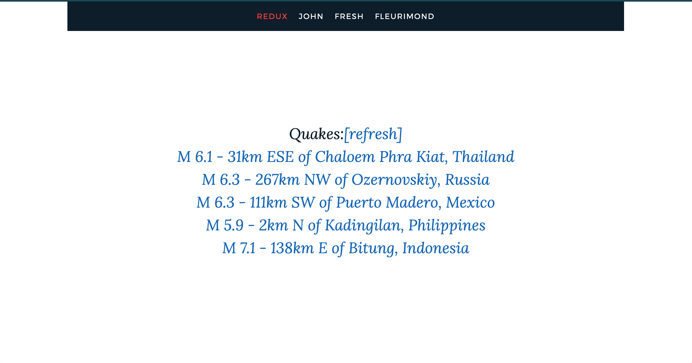

# :checkered_flag:What It Looks Like :checkered_flag:: 

# My Awesome Project
This application is a React Redux-Saga app that show a simple list of recent earthquakes.

# How It's Made :nut_and_bolt:🔨 :hammer::wrench::
This application is made with React, Redux, Redux-Saga, Axios, Webpack, and Babel. This was the first time I didnt use create-react-app

## Optimizations.
Finish the app, I want to see if I can use Redux & Redux-Saga in other apps

 # How It's Works:white_check_mark::
1.) A user can send form data to Mongodb Databse.

2.) User can see the json data once submit as an alert!

## Lessons Learned :mortar_board::

How to spin up your own webpack instead of useing create-react-app. Redux & Redux-Saga, actions, revolvers, sagas and how they handle state
 

# Portfolio :open_file_folder::

** :computer:   WEBSITE:** [John Fleurimond](http://johnfleurimond.com)

# How To Get It Started :arrow_forward: :

## Installation

1. Clone repo
2. run `npm install`

## Available Scripts

In the project directory, you can run:

### `npm run build`

then

### `npm run start`

Runs the app in the development mode. 
Open [http://localhost:3000](http://localhost:3000) to view it in the browser.

The page will reload if you make edits. 
You will also see any lint errors in the console.

### `npm test`

Launches the test runner in the interactive watch mode. 
See the section about [running tests](#running-tests) for more information.

### `npm run build`

Builds the app for production to the `build` folder. 
It correctly bundles React in production mode and optimizes the build for the best performance.

The build is minified and the filenames include the hashes. 
Your app is ready to be deployed!

See the section about [deployment](#deployment) for more information.
### `npm run prettier`
This corrects the format.

### `npm run eject`

**Note: this is a one-way operation. Once you `eject`, you can’t go back!**

If you aren’t satisfied with the build tool and configuration choices, you can `eject` at any time. This command will remove the single build dependency from your project.

Instead, it will copy all the configuration files and the transitive dependencies (Webpack, Babel, ESLint, etc) right into your project so you have full control over them. All of the commands except `eject` will still work, but they will point to the copied scripts so you can tweak them. At this point you’re on your own.

You don’t have to ever use `eject`. The curated feature set is suitable for small and middle deployments, and you shouldn’t feel obligated to use this feature. However we understand that this tool wouldn’t be useful if you couldn’t customize it when you are ready for it.